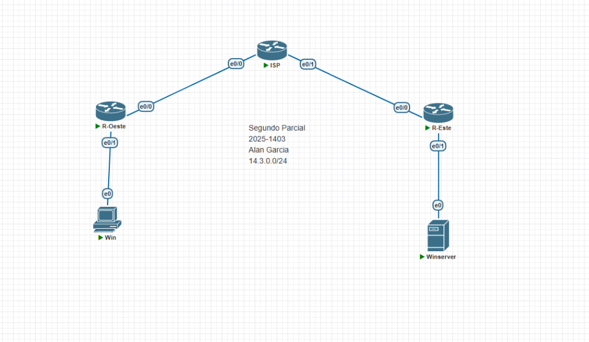
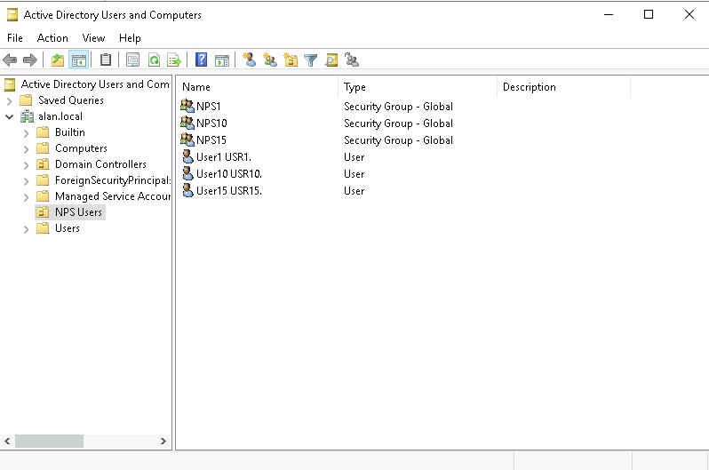
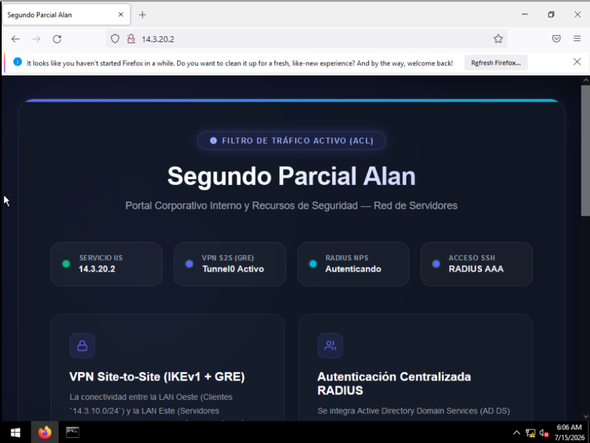
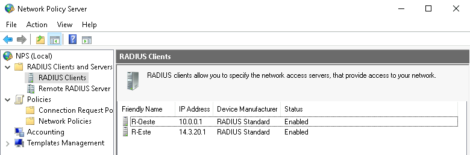
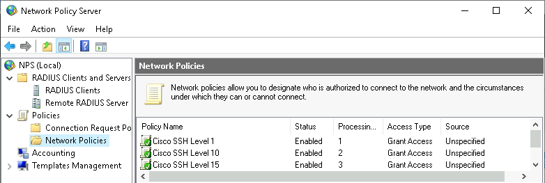
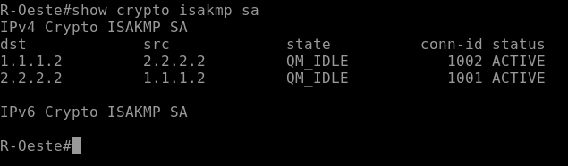
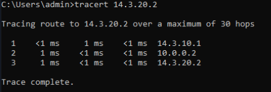
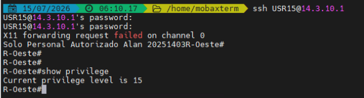

<style>
/* Evitar orfandad de títulos al exportar a PDF */
h1, h2, h3, h4, h5, h6 {
  page-break-after: avoid !important;
  break-after: avoid !important;
}

/* Evitar que los bloques de artículos se corten entre páginas */
.article-block {
  display: block !important;
  page-break-inside: avoid !important;
  break-inside: avoid !important;
}

/* Evitar que imágenes, tablas, código, párrafos, listas y citas se dividan */
img, table, pre, p, li, tr, blockquote, figure, div[style*="text-align: center"] {
  page-break-inside: avoid !important;
  break-inside: avoid !important;
}

/* Asegurar que el body no interfiera con los saltos de página en la impresión */
@media print {
  body {
    max-width: none !important;
    margin: 0 !important;
    padding: 0 !important;
  }
}
</style>

<div style="text-align: center; padding-top: 50px; font-family: 'Outfit', sans-serif;">

<h1>Instituto Tecnológico de Las Américas (ITLA)</h1>
<br><br>
<h2>Implementación de Infraestructura de Red Segura con VPN Site-to-Site (IKEv1 + GRE) y Autenticación Centralizada RADIUS</h2>
<p style="text-align: center; font-size: 1.2em; color: #555; margin: 1em 0;">Documentación Técnica de Examen — Segundo Parcial</p>
<br><br><br>
<div class="presentacion-card" style="border: 1px solid #ccc; padding: 20px; display: inline-block; border-radius: 10px; text-align: left; background-color: #fafafa; box-shadow: 0 4px 6px rgba(0,0,0,0.05);">
<strong>Estudiante:</strong> Alan Daniel Garcia Mendez<br>
<strong>Matrícula:</strong> 2025-1403<br>
<strong>Carrera:</strong> Seguridad Informática<br>
<strong>Asignatura:</strong> Seguridad de Redes<br>
<strong>Docente:</strong> Jonathan Esteban Rondon Corniel<br>
<strong>Fecha de Entrega:</strong> 15 de julio de 2026<br>
<strong>Enlace Video:</strong> <a href="https://youtu.be/tIp-_Fub9n0">https://youtu.be/tIp-_Fub9n0</a><br>
</div>
</div>

<div class="article-block">

## 1. Introducción y Objetivos
El presente documento detalla el diseño e implementación de una infraestructura de red corporativa segura, que interconecta dos sucursales (Oeste y Este) a través de una red pública simulada (ISP). Los objetivos principales de este laboratorio son:

* Establecer una comunicación cifrada y segura de sucursal a sucursal mediante un enlace VPN Site-to-Site IKEv1 sobre un túnel GRE (Generic Routing Encapsulation) en modo transporte IPSec.
* Implementar autenticación, autorización y registro centralizado (Cisco AAA) para la gestión administrativa de los equipos de red mediante RADIUS, utilizando el rol Network Policy Server (NPS) en Windows Server integrado con Active Directory (AD DS).
* Crear políticas de acceso diferenciado basadas en el nivel de privilegio de Cisco (15, 10 y 1) asociadas a grupos de seguridad del dominio.
* Restringir el acceso hacia el servidor web IIS en la zona interna permitiendo exclusivamente tráfico HTTP e ICMP, bloqueando cualquier otro tipo de solicitudes.
* Configurar direccionamiento IP de interfaces físicas y de túneles lógicos basado de manera única en la matrícula del estudiante (`2025-1403`).

</div>

<div class="article-block">

## 2. Topología Lógica y Direccionamiento IP
La topología lógica consta de tres zonas de red principales: la sucursal Oeste (LAN Clientes), la sucursal Este (LAN Servidores) y el proveedor de servicios de internet (ISP) en el núcleo de la red. 

El direccionamiento IP se ha diseñado asignando subredes y direcciones específicas en base a los dígitos de la matrícula **2025-1403** (usando los bloques **14** y **03**, lo que produce el prefijo de red base **`14.3.x.y`**):

* **LAN Oeste (Clientes):** `14.3.10.0/24` (Gateway: `14.3.10.1`, Windows Client: `14.3.10.11` vía DHCP).
* **LAN Este (Servidores):** `14.3.20.0/24` (Gateway: `14.3.20.1`, Windows Server AD/IIS/NPS: `14.3.20.2`).
* **Subred WAN Oeste - ISP:** `1.1.1.0/30` (R-Oeste WAN: `1.1.1.2`, ISP: `1.1.1.1`).
* **Subred WAN Este - ISP:** `2.2.2.0/30` (R-Este WAN: `2.2.2.2`, ISP: `2.2.2.1`).
* **Túnel GRE VPN logical:** `10.0.0.0/30` (R-Oeste Tunnel0: `10.0.0.1`, R-Este Tunnel0: `10.0.0.2`).

El detalle del direccionamiento lógico para cada dispositivo se estructura de la siguiente manera:

| Dispositivo / Rol | Interfaz | Dirección IP | Máscara de Red | Puerta de Enlace |
| :--- | :--- | :--- | :--- | :--- |
| **R-Oeste (Gateway Oeste)** | Ethernet0/0 | `1.1.1.2` | `255.255.255.252` | `1.1.1.1` |
| | Ethernet0/1 | `14.3.10.1` | `255.255.255.0` | N/A |
| | Tunnel0 | `10.0.0.1` | `255.255.255.252` | N/A |
| **R-Este (Gateway Este)** | Ethernet0/0 | `2.2.2.2` | `255.255.255.252` | `2.2.2.1` |
| | Ethernet0/1 | `14.3.20.1` | `255.255.255.0` | N/A |
| | Tunnel0 | `10.0.0.2` | `255.255.255.252` | N/A |
| **ISP (Proveedor Core)** | Ethernet0/0 | `1.1.1.1` | `255.255.255.252` | N/A |
| | Ethernet0/1 | `2.2.2.1` | `255.255.255.252` | N/A |
| **Windows Server** | Ethernet0 | `14.3.20.2` | `255.255.255.0` | `14.3.20.1` |
| **Windows Client** | Ethernet0 | `14.3.10.11` (DHCP) | `255.255.255.0` | `14.3.10.1` |

<br>
<div style="text-align: center;">
    
    <p><em>Figura 1: Topología lógica del escenario implementada en GNS3.</em></p>

</div>

</div>

<div class="article-block">

## 3. Configuración de Windows Server
El Windows Server (`14.3.20.2`) centraliza los roles de Directorio Activo, Servidor de Nombres (DNS), Servidor de Políticas de Red (NPS) para RADIUS, y Servidor de Intranet (IIS).

### 3.1 Active Directory Domain Services (AD DS)
Se crea el dominio local `alan.local` (NetBIOS: `ALAN`). A nivel de organización, se estructuran los grupos de seguridad encargados del control de acceso a los equipos de red:

* **NPS15 (Nivel 15):** Grupo de administradores con privilegios completos.
* **NPS10 (Nivel 10):** Grupo de técnicos de soporte de red.
* **NPS1 (Nivel 1):** Grupo de monitoreo o lectura de red.

Dentro de estos grupos se crean y asocian las cuentas de usuario respectivas (`User15 USR15`, `User10 USR10`, `User1 USR1`) para realizar las pruebas de autenticación.

<br>
<div style="text-align: center;">
    
    <p><em>Figura 2: Consola de Active Directory mostrando los grupos de seguridad y los usuarios creados para las directivas NPS.</em></p>

### 3.2 Internet Information Services (IIS)
Se despliega el servidor web IIS en Windows Server. La intranet corporativa de V&L Consultores Legales se aloja en el directorio predeterminado `C:\inetpub\wwwroot\index.html` utilizando el portal HTML premium diseñado. El archivo correspondiente está almacenado en el repositorio bajo: [index.html](resources/index.html).

<br>
<div style="text-align: center;">
    
    <p><em>Figura 3: Portal web intranet de IIS "Segundo Parcial Alan" cargado en el Windows Client.</em></p>
</div>

### 3.3 Network Policy Server (NPS) y AAA RADIUS
El servicio NPS gestiona las solicitudes de acceso SSH provenientes de los routers. El flujo de configuración requiere:

1. **Clientes RADIUS:** Se registran los routers `R-Oeste` (identificado en la red interna con su IP origen de túnel `10.0.0.1`) y `R-Este` (`14.3.20.1`) como clientes RADIUS de confianza. Se establece la clave secreta compartida: `20251403`.
    <br>
    <div style="text-align: center;">
        
        <p><em>Figura 4: Clientes RADIUS registrados en el NPS para R-Oeste (10.0.0.1) y R-Este (14.3.20.1).</em></p>
    </div>
2. **Políticas de Red (Network Policies):** Se configuran tres políticas de acceso independientes con el siguiente orden de evaluación y condiciones:
   * **Cisco SSH Level 1 (Prioridad 1):** Evalúa la membresía en el grupo `ALAN\NPS1`. En los atributos de respuesta del RADIUS (pestaña Settings -> Vendor Specific Attributes) se inyecta el Vendor Code `9` (Cisco) con el VSA **`shell:priv-lvl=1`**.
   * **Cisco SSH Level 10 (Prioridad 2):** Evalúa la membresía en el grupo `ALAN\NPS10`. Inyecta el atributo Cisco-AV-Pair **`shell:priv-lvl=10`**.
   * **Cisco SSH Level 15 (Prioridad 3):** Evalúa la membresía en el grupo `ALAN\NPS15`. Inyecta el atributo Cisco-AV-Pair **`shell:priv-lvl=15`**.
    <br>
    <div style="text-align: center;">
        
        <p><em>Figura 5: Directivas de red (Network Policies) estructuradas en el NPS según el nivel de privilegio.</em></p>
    </div>

</div>

</div>

<div class="article-block">

## 4. Configuración de Dispositivos Cisco (Cisco IOS)
Todos los comandos y configuraciones completas aplicados a los routers se encuentran estructurados y comentados de forma organizada en los siguientes recursos del repositorio:

* Script de Configuración del Router Oeste: [r_oeste_config.txt](resources/r_oeste_config.txt).
* Script de Configuración del Router Este: [r_este_config.txt](resources/r_este_config.txt).
* Script de Configuración del Router ISP: [r_isp_config.txt](resources/r_isp_config.txt).

### 4.1 Enrutamiento, NAT y Restricción por Listas de Acceso (ACL)
Para el tráfico general se configuran las siguientes políticas a nivel de Capa 3:

* **Rutas por Defecto:** Tanto `R-Oeste` como `R-Este` tienen configuradas rutas estáticas por defecto apuntando a la IP de su interfaz de conexión física en el ISP, garantizando que todo el tráfico desconocido se dirija al proveedor.
* **NAT Overload (PAT) con Exclusión:** Ambos gateways de red realizan traducción de puertos para permitir la salida de los clientes locales a Internet (ISP). No obstante, para garantizar que la comunicación interna LAN a LAN no sea traducida (y pase a través del túnel VPN sin alterarse), se aplica una lista de acceso de traducción que deniega el tráfico entre el bloque de subredes locales y permite la traducción para todo lo demás.
* **Filtros por ACL en el Servidor:** La seguridad del servidor IIS se gestiona aplicando la lista de acceso extendida `ACL_SERVER_LIMIT` en el router `R-Este`. Esta lista permite únicamente las conexiones TCP con destino al puerto 80 (HTTP) y los paquetes ICMP (Ping) dirigidos a la IP `14.3.20.2`. El resto de tránsitos (ej. RDP puerto 3389, SMB puerto 445) provenientes de la LAN remota Oeste son denegados por completo.

</div>

<div class="article-block">

## 5. Implementación de la VPN Site-to-Site
La interconexión segura entre la LAN Oeste y la LAN Este se realiza implementando un túnel GRE protegido por IPSec mediante políticas ISAKMP tradicionales en IKEv1:

### 5.1 Parámetros ISAKMP de Fase 1
La fase de control se negocia mediante los siguientes parámetros de encriptación simétrica e intercambio de claves Diffie-Hellman:

* **Algoritmo de Cifrado:** AES-256 bits.
* **Función Hashing / Integridad:** SHA-256 bits.
* **Grupo DH:** Group 14 (claves de 2048 bits para resistencia a ataques de fuerza bruta).
* **Método de Autenticación:** Pre-Shared Key (Clave compartida).
* **Clave Compartida:** Clave pre-compartida basada en la matrícula: `20251403`.

### 5.2 Parámetros IPSec de Fase 2
Para optimizar el rendimiento y evitar la duplicidad de cabeceras IP, se configura la protección IPSec utilizando el modo de operación **Transport Mode** (`mode transport`). La encriptación y el hashing de la carga útil del túnel GRE se configuran en el Transform-Set `TS_GRE_IKEV1` (`esp-aes 256 esp-sha256-hmac`).

La asociación criptográfica se realiza de forma directa aplicando el perfil de protección IPSec sobre la interfaz lógica del túnel:
```text
interface Tunnel0
 tunnel protection ipsec profile PROFILE_GRE
```

<br>
<div style="text-align: center;">
    
    <p><em>Figura 6: Verificación del estado activo (ACTIVE) del túnel VPN IKEv1 (ISAKMP) en R-Oeste.</em></p>

</div>

</div>

<div class="article-block">

## 6. Procedimiento de Verificación y Plan de Pruebas
Para documentar el correcto funcionamiento de los entregables y asegurar una calificación máxima, el estudiante debe realizar y grabar un video explicativo de menos de 5 minutos que demuestre secuencialmente los siguientes puntos de control:

1.  **Running Config de los Routers:** Ejecutar en el modo privilegiado de `R-Oeste` y `R-Este` el comando `show running-config` para demostrar la correcta sintaxis de interfaces, AAA, NAT y criptografía.
2.  **Rastreo de Ruta (Tracert):** Ejecutar desde el CMD de la máquina Windows Client el comando `tracert 14.3.20.2`. La salida de consola debe validar que el paquete viaja a través del gateway local `14.3.10.1`, pasa por la IP del túnel GRE remoto `10.0.0.2` en el segundo salto, y finalmente alcanza el servidor, demostrando que el tráfico LAN a LAN transita de forma exclusiva y encriptada por la VPN.
    <br>
    <div style="text-align: center;">
        
        <p><em>Figura 7: Ejecución de tracert verificando que el tráfico LAN a LAN pasa a través del túnel VPN (10.0.0.2).</em></p>
3.  **Acceso Web a la Intranet IIS:** Abrir el navegador web (Edge/Firefox) en el Windows Client y acceder a la dirección `http://14.3.20.2`. Se debe cargar el portal corporativo de intranet mostrando el título "Segundo Parcial Alan" y tu matrícula.
4.  **Verificación de Direccionamiento en Windows Client:** Ejecutar `ipconfig /all` en el Windows Client para validar que obtiene direccionamiento dinámico dentro del segmento de matrícula asignado por el servidor DHCP de R-Oeste.
5.  **Verificación de Funcionamiento de la ACL:** Realizar una prueba de conectividad desde el cliente usando ping (`ping 14.3.20.2`) y verificar que responde correctamente. Posteriormente, intentar establecer una conexión remota RDP (`mstsc`) o transferencia de archivos hacia el servidor para evidenciar que el tráfico es bloqueado por la ACL en el router.
6.  **Autenticación en Equipos con 3 Usuarios de AD:** Iniciar sesión por SSH desde un cliente hacia los routers utilizando las credenciales de AD configuradas:
    *   Iniciar sesión con el usuario de nivel 15 (`USR15`) y ejecutar `show privilege` para demostrar que se entra directamente en modo de configuración de nivel 15.
        <br>
        <div style="text-align: center;">
            
            <p><em>Figura 8: Prueba de inicio de sesión SSH con USR15 y validación de privilegio de nivel 15.</em></p>
        </div>
    *   Iniciar sesión con el usuario de nivel 10 para comprobar que se asigna el nivel 10.
    *   Iniciar sesión con el usuario de nivel 1 para verificar que el nivel de acceso se restringe al mínimo.
</div>
</div>
